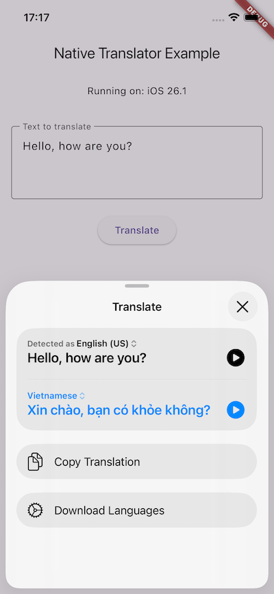
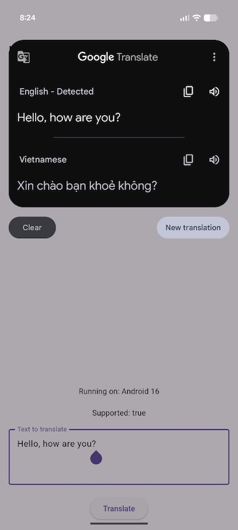

# native_translator

iOS native translate text

+ Minimum iOS version: 15.0

# How to use
Open native dialog systems translate:

```bash
  await NativeTranslator().translateText(
    text: _textController.text,
  );
```

iOS document:
  - https://developer.apple.com/documentation/Translation/translating-text-within-your-app
Android document: https://developer.android.com/guide/topics/ui/look-and-feel/translations

| iOS | Android |
|--------|--------|
|  |  |


# Orther solution:
  - Google Translate API:
    - [Google Translate API](https://developers.google.com/translate/v2)
    - [https://developers.google.com/ml-kit/language/translation/android](https://developers.google.com/ml-kit/language/translation/android)
  - Pub dev:
    - [https://pub.dev/packages/translator](https://pub.dev/packages/translator)
    - [https://pub.dev/packages/google_mlkit_translation](https://pub.dev/packages/google_mlkit_translation)
    - [https://pub.dev/packages/text_translation](https://pub.dev/packages/text_translation)
    - [https://pub.dev/packages/flutter_google_translate](https://pub.dev/packages/flutter_google_translate)
